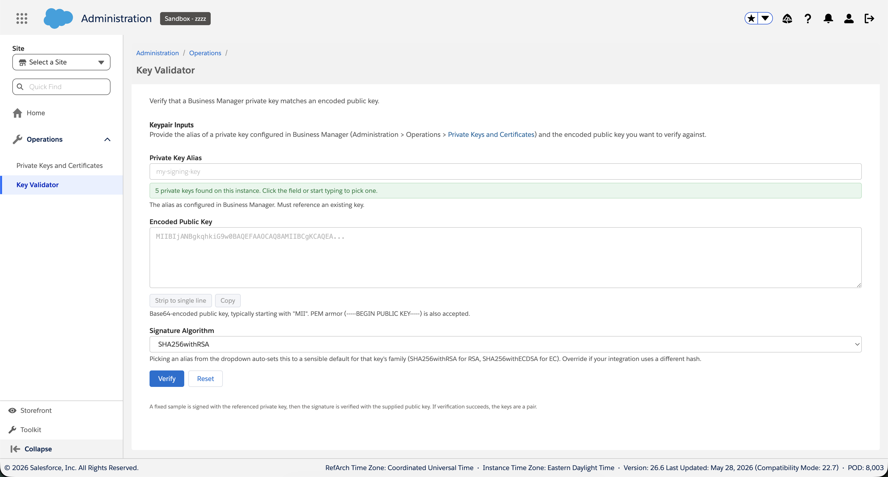

# bm_keyvalidator

A standalone Business Manager extension cartridge that confirms a private key configured in BM and an encoded public key form a matching pair. Most useful during DKIM setup, where verifying that the public key published in DNS matches the private key configured as the signer is otherwise a manual, error-prone ritual; equally at home for mTLS, SAML, JWT signing, or any other keypair-based integration.

The cartridge signs a fixed sample with the private key, then verifies that signature against the supplied public key. Successful verification means the keys are a pair.



## Quick start

Assumes you already have a private key imported in BM and a public key you want to verify against it.

1. **Push the cartridge** to whatever code version you want. The repo ships a `scripts/deploy.sh` convenience that zips the cartridge (filtering out `test/`, `package.json`, dev scaffolding, and any local key material), uploads via WebDAV, unzips it server-side, and cleans up – all without touching whatever else is already in that code version. Sandbox is a one-liner; the script prompts for WebDAV credentials if you don't supply them. Production is refused outright (deploy to staging and replicate).

   ```sh
   ./scripts/deploy.sh -H zzzz_001 -V version1
   ```

   Staging requires mTLS – pass your client cert with `--p12 <path>` (and `--p12-pass` or `SFCC_WEBDAV_P12_PASSWORD` for the passphrase). Run `scripts/deploy.sh -h` for the full set of flags and env-var equivalents.

   You're not obligated to use it: the cartridge is a plain WebDAV upload, so any UX Studio / `sfcc-ci` / Prophet / custom flow you already have works. The script is just a built-in path that requires no external setup.

   Whichever code version you push to, make sure it's the *active* one in *Administration > Site Development > Code Deployment* before continuing. Cartridges in inactive code versions are uploaded fine but never loaded.
2. **Add `bm_keyvalidator` to the Business Manager site's cartridge path.** This is the most-missed step. Without it BM never loads the cartridge and the menu item below won't appear: *Administration > Sites > Manage Sites > Business Manager > Settings*.
3. **Grant access** (non-admins only) in *Administration > Organization > Roles & Permissions*. Open the role you want to grant, switch to the **Business Manager Modules** tab, and check:
   - **Key Validator** (Write) – required. The only checkbox the row exposes; merchant-cartridge menu actions can't be marked read-only-eligible at the platform level, even though this tool doesn't actually mutate anything BM-side.
   - **Private Keys and Certificates** (Read) – optional but recommended. Without it the alias dropdown can't autofill from the instance, and the user falls back to typing the alias by hand (still works, just less ergonomic).

   BM Administrators have every BM Modules permission automatically and can skip this step.
4. **Open the tool** at *Administration > Operations > Key Validator*. Pick a private key alias, paste your encoded public key, click **Verify**.

## What makes it worth using

Every choice this cartridge makes is in service of an operator who's mid-task and doesn't want to fight their tools. A short tour:

### Reactive alias dropdown

On page load the cartridge fetches the imported private-key list from the OCAPI Data API and feeds it into a `<datalist>` attached to the alias input. You see your actual aliases without context-switching to the *Private Keys and Certificates* page. If the lookup fails for any reason the input remains a free-text field and a non-blocking notice explains why.

### Algorithm auto-pick

When you choose an alias from the dropdown, the cartridge inspects the key's algorithm family and updates the **Signature Algorithm** select to a sensible default: `SHA256withRSA` for RSA keys, `SHA256withECDSA` for EC keys. Manual overrides stick for the rest of the session – we trust your explicit choice over our inference.

### Whitespace advisory

The platform's Base64 decoder happily tolerates a stray space or tab in the public-key body, but stricter consumers (DKIM DNS TXT record verifiers, third-party services) won't. The result panel surfaces a warn-level advisory whenever non-newline whitespace is detected, so you can fix the canonical copy of the key before publishing it elsewhere.

### Length / family fitness check

When you pick an alias from the dropdown the cartridge knows the key's algorithm family (RSA / EC) and modulus size, which means it knows exactly how many Base64 characters the matching public key should encode to. Pasting a key that's the wrong length – truncated, padded with extra bytes, or from an entirely different family – surfaces a warn-level notice with the actual and expected counts before you click Verify. The check is advisory, not a submit-block, so you can still send through anything you want; it's there to catch the "wrong file open in clipboard" or "rotated key swap" classes of mistake without a server round-trip.

### Strip-to-single-line and Copy

Two compact utility buttons sit under the public-key textarea. **Strip to single line** removes PEM armor and all whitespace down to the bare Base64 form a DKIM DNS TXT record needs (and fires its own warn-level notice if it found a stray space, so an almost-right key gets flagged before it leaves your machine). **Copy** sends the textarea contents to the clipboard for pasting elsewhere.

### AJAX result rendering

The form posts to `KeyValidator-Verify` and the result panel renders inline – no page reload. Inputs stay populated across iterations, which is exactly what you want when you're flipping back and forth between submitting and copying-out for DNS publication.

### Hyperlinked references

Every mention of *Private Keys and Certificates* in the UI is a hyperlink into the BM page that opens in a new tab. Built via `URLUtils.url(...)` in the controller so the link works on every instance without hardcoded hosts.

### Visual parity with native BM screens

Modern BM screens (Jobs, Private Keys) load `dw.ui.core.css`, `dw-ui-no-conflict.min.css`, and Salesforce Sans automatically. Classic-pipeline screens like ours don't. The cartridge bundles those two stylesheets and the 12 Salesforce Sans `.woff`/`.woff2` files so the breadcrumbs, page title, form fields, and buttons all render in BM's calibrated 1.0 line-height in Salesforce Sans rather than the browser's default 1.5 in `system-ui`.

### Localization-ready

Every user-facing string flows through `Resource.msg` against `templates/resources/keyvalidator.properties`. Drop a locale-specific `keyvalidator_<lang>.properties` next to it (or under `templates/resources/<locale>/`) and BM switches on session locale with no code changes. The default English bundle is the only one shipped today, but adding others is a copy-and-translate exercise.

### Pure-BM, zero npm

No SFRA, no `app_storefront_base`, no npm runtime dependencies. The cartridge stands alone in a BM cartridge path. Tests run on Node's built-in test runner against in-process fakes for `dw.crypto.Signature` and `dw.crypto.KeyRef`, so you don't need a sandbox or any install step to run them.

### Defended at the boundaries

- **CSRF**: the form POST is protected by `dw.web.CSRFProtection`.
- **XSS**: all dynamic output is HTML-escaped via ISML `${...}`. The few cases that need an inline link in client-rendered notices are built as DOM nodes, never via `innerHTML`.
- **Authn**: as a BM extension, the cartridge inherits BM's existing login, role-permission, and audit-logging system. Anything that drives `dw.crypto.Signature.sign()` against production keys belongs behind that authentication, not on a public storefront route.
- **Audit trail**: every Verify submission logs the alias, algorithm, and supplied public key at INFO via `dw.system.Logger`; CSRF rejections and crypto failures log at WARN; unexpected exceptions at ERROR. All severities for this cartridge land in `custom-keyvalidator-*.log` (the cartridge specifies a custom log file prefix, so severity is part of the line metadata rather than the file name). Within that file, category `KeyValidator` covers controller-level events and `CertificateFetcher` covers the alias-lookup OCAPI flow. None of the logged fields are secret – alias is a public identifier, public keys are public by definition, algorithm is metadata.

## Generating a test keypair

If you don't already have a keypair to test with, `scripts/gen-test-keypair.sh` runs the full `openssl` recipe end-to-end. Pass an alias as the first arg (defaults to `keyvalidator-test`):

```sh
./scripts/gen-test-keypair.sh my-alias
```

Writes `<alias>.{key,crt,p12,pub}` under `tmp/<alias>/` and prints the public key (PEM) to stdout. Defaults to 2048-bit RSA, passphrase `test`. Run with `-h` for usage.

Import the resulting `.p12` via *Administration > Operations > Private Keys and Certificates*, then paste the public key into the form. You should see **Keys match.**

If you'd rather drive `openssl` yourself, the equivalent commands are:

```sh
openssl genrsa -out keyvalidator-test.key 2048
openssl req -new -x509 -key keyvalidator-test.key \
    -out keyvalidator-test.crt -days 3650 \
    -subj "/CN=keyvalidator-test"
openssl pkcs12 -export \
    -inkey keyvalidator-test.key \
    -in    keyvalidator-test.crt \
    -name  keyvalidator-test \
    -out   keyvalidator-test.p12 \
    -passout pass:test
openssl x509 -in keyvalidator-test.crt -pubkey -noout
```

## Layout

```
bm_keyvalidator/
├── cartridge/
│   ├── bm_extensions.xml                       BM menu action registration
│   ├── bm_keyvalidator.properties              Cartridge metadata
│   ├── controllers/
│   │   └── KeyValidator.js                     Show / Verify / Aliases endpoints
│   ├── scripts/
│   │   ├── keyValidator.js                     Pure validation logic (DI-friendly)
│   │   ├── keyValidatorHelpers.js              Pure presentation helpers
│   │   └── certificateFetcher.js               OCAPI bridge for the alias dropdown
│   ├── templates/
│   │   ├── default/keyvalidator/
│   │   │   ├── layout.isml                     Page chrome / decorator
│   │   │   └── show.isml                       Form + result UI
│   │   └── resources/
│   │       └── keyvalidator.properties         Page strings (localization-ready)
│   └── static/default/
│       ├── css/
│       │   ├── keyvalidator.css                Cartridge styles
│       │   └── bm-shell/                       Bundled BM shell CSS
│       └── fonts/                              Bundled Salesforce Sans (12 files)
├── scripts/
│   ├── gen-test-keypair.sh                     One-shot test keypair generator
│   └── deploy.sh                               WebDAV deploy helper
├── test/
│   ├── mocks/                                  In-process dw.* fakes
│   ├── unit/                                   node:test suites
│   └── scripts/deploy.test.sh                  Shell tests for deploy.sh
├── docs/
│   └── screenshot.png                          README hero image
├── package.json                                npm test entry point
├── README.md
└── DESIGN.md                                   Implementation notes
```

## Result outcomes

| Outcome  | Meaning                                                                |
|----------|------------------------------------------------------------------------|
| Match    | The signature produced by the private key verified with the public key |
| Mismatch | Signing succeeded but the public key did not verify the signature      |
| Error    | The crypto operation threw – invalid alias, malformed key, etc.        |

## Supported algorithms

Whatever `dw.crypto.Signature` supports. Currently exposed in the dropdown:

- `SHA256withRSA` (default)
- `SHA384withRSA`, `SHA512withRSA`, `SHA1withRSA`
- `SHA256withECDSA`, `SHA384withECDSA`, `SHA512withECDSA`

To extend, edit `SUPPORTED_ALGORITHMS` in `cartridge/scripts/keyValidator.js`. The dropdown and the validation allowlist are driven from that single source.

## Running the tests

```sh
npm test
```

Unit tests cover the validator's branches, the certificate-fetcher's HTTP error categorization, and the controller's pure helpers. Shell tests cover `scripts/deploy.sh`'s host-input resolution. Validation logic is structured with `dw.crypto.Signature` and `dw.crypto.KeyRef` injected, so the test suite swaps in in-process fakes – no SFCC runtime, sandbox, or npm dependencies required.

### Compatibility modes

The cartridge has been spot-checked end-to-end on compatibility modes **18.10** and **22.7** (current latest as of writing). The full match / mismatch / input-error / whitespace-advisory matrix produced identical results on both, including the platform's lenient handling of embedded whitespace in the public-key body.

Compatibility-mode behavior is contractually frozen once a mode is published, so there's no ongoing gate to re-run this matrix on every change. Worth re-checking only if the cartridge starts using a Script API that's known to differ across modes, or if SFCC publishes a new compatibility mode.

## Troubleshooting

- **The Key Validator menu item doesn't appear in Operations.** The cartridge may be on the instance but BM isn't loading it. Check, in order: the code version you uploaded to is the *active* one (*Administration > Site Development > Code Deployment*); the cartridge is on the **Business Manager** site's cartridge path (*Administration > Sites > Manage Sites > Business Manager > Settings*); your user has the *Key Validator* Write perm in *Roles & Permissions > Business Manager Modules* (admins skip this).
- **Alias dropdown shows a yellow warn-notice.** The OCAPI lookup failed and the input falls back to free-text – you can still type the alias by hand. The most common cause is missing *Read* perm on *Private Keys and Certificates* (see Quick start step 3); the notice text spells out the specific category. Genuine network or AM failures get more detail logged at WARN under category `CertificateFetcher` (see *Audit trail* above for where to find it).
- **Verify returns "Verification could not be completed" with a stack-trace blob.** The crypto layer rejected the inputs. Most likely: the alias you typed isn't actually imported on the instance (typo, or a misspelled alias the lookup didn't surface), or the algorithm doesn't match the key family (e.g. `SHA256withRSA` against an EC key). Pick the alias from the dropdown to let the auto-pick set a compatible algorithm.
- **Verify shows "Keys do not match" for keys you're sure should match.** Confirm the public key actually corresponds to the BM-imported private key – it's easy to mix up keypairs from a recent rotation. Generate a fresh known-good pair with `scripts/gen-test-keypair.sh` and run that through the cartridge to rule out an environmental issue.
- **Whitespace advisory keeps appearing on a key you trust.** It will fire whenever the pasted public key contains a space or tab anywhere in the body. Click **Strip to single line** to clean it up; the advisory clears on the next submission. The platform tolerates the whitespace, but DKIM DNS verifiers and other downstream consumers often won't, which is why the advisory exists.

## Why this is a BM extension and not a storefront controller

The tool drives `dw.crypto.Signature.sign()` against private keys imported into Business Manager. Anything that can trigger sign operations against production keys belongs behind production-grade authentication, not on a public storefront route. A BM extension inherits the same login, role-permission, and audit-logging system as the rest of Business Manager.
